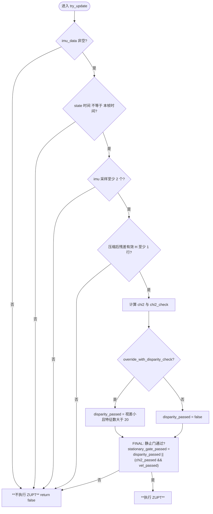

# 是否执行零速度更新（ZUPT）— 判定逻辑图

仅描述 **`UpdaterZeroVelocity::try_update`** 中「**做 / 不做**」ZUPT 的判定，不含 EKF 更新细节。源码：`ov_core/src/update/UpdaterZeroVelocity.cpp`。

静止门统一用 **`*_passed`** 正向语义，与旧写法  
`!disparity_passed && (chi2>阈 || |v|>阈)` **等价**。

**通俗理解**：静止门通过，当且仅当 **视差判据满足**，或者 **卡方与速度两项同时满足**（`stationary_gate_passed = disparity_passed || (chi2_passed && vel_passed)`）。

> **说明（为何不用 `$…$` 数学）**：Cursor / VS Code 内置 Markdown 预览对 **KaTeX + 中文标点 + 行内 `\tilde`/`\mathbf`** 等组合解析不稳定，容易出现整段不渲染。本文**全部公式用等宽代码块或纯文本**书写，**任意** Markdown 预览器显示一致。需要印刷级排版可改用 Typora、Pandoc 或 Doxygen HTML。

---

## 判定流程图



（图中 `&&` 优先于 `||`，与源码括号一致：`disparity_passed || (chi2_passed && vel_passed)`。）

### FINAL 判别式（与源码一致）

```text
chi2_passed  = (chi2 <= chi2_multipler * chi2_check)
vel_passed   = (norm(v_IinG) <= zupt_max_velocity)
stationary_gate_passed = disparity_passed || (chi2_passed && vel_passed)
```

执行 ZUPT 当且仅当 **`stationary_gate_passed` 为真**；否则 `return false`。

（`norm(v_IinG)` 对应 `state->_imu->vel().norm()`。）

---

## 卡方检验条件（`chi2_passed`）

**定义（与文献一致；以下为 ASCII，任意预览器一致）**

```text
  chi^2 = z_tilde' * inv(S) * z_tilde    // 马氏距离平方；源码: chi2 = res.dot(S.llt().solve(res))

  S = H * P_marg * H' + R

  R = alpha * I                        // alpha = zupt_noise_multiplier
```

（`z_tilde` 即带波浪号的残差向量 z̃；`'` 表示转置。）

**逐项说明**

- **z_tilde / z̃（残差）**：压缩后的 `res`（`measurement_compress_inplace` 之后）。
- **P_marg**：`Hx_order` 上的边际协方差；若 `model_time_varying_bias` 为真，偏置块再加 `Q_bias`。
- **α**：标量，源码成员 `zupt_noise_multiplier`。
- **阈值**：`chi2_check = chi2_quantile_095(res.rows())`，按压缩后维数取 95% 分位。
- **通过**：`chi2_passed = (chi2 <= chi2_multipler * chi2_check)`。
- **配置**：`zupt_chi2_multipler` → `UpdaterOptions::chi2_multipler`；默认见 `UpdaterOptions.h`。

**含义**：残差 **z_tilde** 为 ZUPT 合成量；**S** 综合 **P_marg** 与 **R**。**chi²** 检验残差相对 **S** 是否异常大（一致性门限），不是单纯「残差绝对值小」。

---

## 速度条件（`vel_passed`）

```text
vel_passed  <=>  norm(v) <= zupt_max_velocity

v  <-  state->_imu->vel()     // global frame, IMU velocity
```

其中 **`zupt_max_velocity`** 在 `VioManagerOptions` 中配置，默认约 **1.0**（单位与状态一致，一般为 m/s）。

---

## 真值表（核心门）

| disparity_passed | chi2_passed 且 vel_passed | **执行 ZUPT** |
|------------------|---------------------------|---------------|
| 是               | 任意                      | **是**        |
| 否               | 是                        | **是**        |
| 否               | 否                        | **否**        |

---

## 姿态（角度）与灵敏度（为何 ZUPT 要「对角度也敏感」）

静止段若只靠「线速度小」，**不足以**约束**倾侧姿态**；工程上常希望 ZUPT 对**角度误差**也足够敏感，当前实现里主要来自两条：

1. **陀螺支路**：残差约束「角速度为 0」，直接作用在 **b_g** 与陀螺相关状态；白化权重与 `sigma_w` 有关，**不要把 `zupt_noise_multiplier` 抬得过高**，否则等效上会对陀螺通道「过不信」，姿态/陀螺偏置修正变钝。
2. **加计支路**：残差为 `a_hat - R*g`，雅可比对 **姿态 q** 有块（重力在机体系的方向随 **滚转/俯仰** 而变），静止时对 **倾角** 通常比 **航向** 更敏感（纯重力对绕竖直轴转动弱）。

因此：**「零速度」若被理解成只卡平移，会低估姿态需求**；本算法通过 **ω 与 g 在机体系的一致性** 同时约束**角速度与倾侧**，与「要对角度足够敏感」的目标一致。若仍觉姿态收不紧：优先检查 **IMU 噪声标定**、`zupt_noise_multiplier`、以及 **`chi2` 门限是否过松**（易整段更新被挡掉）；需要更强航向约束需**视觉/磁**等，单靠静止 IMU 有限。

### 另一目标：希望「对加速度没那么敏感」

多旋翼、车载等场景常有 **振动、线加速度毛刺**，若加计通道过「信」，ZUPT 容易 **误拒** 或 **过度拉偏置/姿态**。这与「靠加计支路看倾角」**同一套物理量**，存在折中：

| 诉求 | 做法思路（思路级） | 与实现的关系 |
|------|-------------------|--------------|
| 加计别太敏感 | 增大加计**等效噪声**（白化里 `w_accel` 与连续时间 `sigma_a` 有关） | 源码 `w_accel = sqrt(dt)/sigma_a`：`sigma_a` **越大**，同样 `a_hat - R*g` 在残差里**权重越小**，对加速度残差更「宽容」 |
| 陀螺仍要敏感 | 保持或略收紧 `sigma_w`（陀螺白化） | 与 `sigma_a` **分开调**，可在一定程度上**不对称**强调陀螺 vs 加计 |
| 两路一起松 | `zupt_noise_multiplier` 放大整段 `R` | **陀螺与加计在检测里一起松**，姿态灵敏度也会一起下降，不是「只松加计」 |

**结论**：当前 **`UpdaterZeroVelocity`** 里，**堆叠残差** 的 `R` 在压缩后是 **标量乘单位阵**（`zupt_noise_multiplier`），**没有**单独的「加计乘数 / 陀螺乘数」开关；若产品上要 **「姿态仍敏感、加计更钝」**，需要在实现上**对加速度计行单独加大 R 或单独调白化**（或中频滤波后再进 ZUPT），与现有 OpenVINS 默认 ZUPT 不是同一套参数能完全解耦的。

---

## 说明

- `override_with_disparity_check == false` 时，`disparity_passed` 恒为假，须 **`chi2_passed && vel_passed`** 才能通过静止门。
- `VioManager` 是否在每帧调用 `try_update`，见 `track_image_and_update` 中 `try_zupt`、初始化、`zupt_only_at_beginning` 等条件（本图不展开）。
